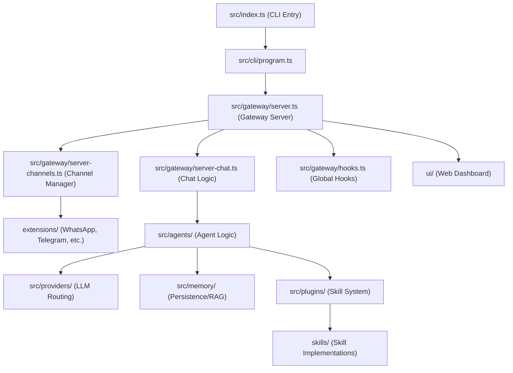

# 🔬 ANTIGRAVITY INTELLIGENCE — OpenClaw Codebase Analysis

## PURPOSE
This document provides a deep architectural analysis of the OpenClaw AI agent codebase. The goal is to extract patterns and design principles to inform the development of **Antigravity**, a Python/FastAPI-based AI operations agent for the Sanaa fintech platform.

---

## ━━━━━━━━━━━━━━━━━━━━━━━━━━━━━━━━━━━━━━━━━━━━━━━
## TASK 1: DIRECTORY STRUCTURE & ARCHITECTURE MAP
## ━━━━━━━━━━━━━━━━━━━━━━━━━━━━━━━━━━━━━━━━━━━━━━━

### Top-Level Directory Structure

| Directory | Purpose |
| :--- | :--- |
| `src/` | Core TypeScript source code for the OpenClaw gateway and agent logic. |
| `apps/` | Platform-specific components (macOS, iOS, Android). |
| `packages/` | Internal shared packages (e.g., `clawdbot`, `moltbot`). |
| `extensions/` | Plugin-style integrations for messaging channels and core features. |
| `skills/` | Built-in and user-defined agent skills (actions/tools). |
| `docs/` | Comprehensive documentation including architecture, installation, and guides. |
| `scripts/` | Build, test, and utility scripts. |
| `ui/` | Web-based dashboard and control interface. |
| `vendor/` | External dependencies or vendored libraries. |

### Core Architecture Map (src/)

### Entry Points
- **CLI**: `openclaw.mjs` (calls `src/index.ts`)
- **Main Logic**: `src/index.ts` initializes the environment, loads config, and builds the CLI program.
- **Gateway**: `src/gateway/server.ts` is the heart of the WebSocket/HTTP control plane.

### Extensions & Plugin System
OpenClaw uses a highly modular system:
- **Extensions**: Found in `extensions/`, these provide heavy-weight integrations like messaging channels.
- **Skills**: Found in `skills/`, these are tool definitions that the agent can execute.

---

## ━━━━━━━━━━━━━━━━━━━━━━━━━━━━━━━━━━━━━━━━━━━━━━━
## TASK 2: GATEWAY & WEBSOCKET CONTROL PLANE
## ━━━━━━━━━━━━━━━━━━━━━━━━━━━━━━━━━━━━━━━━━━━━━━━

### Gateway Architecture (src/gateway/)
The gateway handles all communications between messaging channels, the LLM, and the user-facing UI.

- **Session Management**: Managed in `src/gateway/session-utils.ts` and `src/config/sessions.ts`. Sessions are typically stored as `.jsonl` files in `sessions/`.
- **Message Routing**: `src/gateway/server-chat.ts` routes incoming messages to the appropriate agent and handles the response flow.
- **Protocol**: Uses a custom protocol (ACP - Agent Client Protocol) defined in `src/gateway/protocol/`.
- **Authentication**: `src/gateway/auth.ts` implements token-based authentication.
    - **Vulnerability Note**: This is where CVE-2026-25253 occurred (injecting `gatewayUrl` via query params allowed token exfiltration).
- **Isolation**: Agents and workspaces are isolated by session keys and directory structures (`agents/<agent-id>`).

### Extraction for Antigravity
- **Pattern**: Use a centralized `MessageRouter` that decouples the message source (WhatsApp, Web, etc.) from the LLM logic.
- **Auth**: Implement robust token validation with strict origin checks and NO dynamic gateway URLs from client input.

---

## ━━━━━━━━━━━━━━━━━━━━━━━━━━━━━━━━━━━━━━━━━━━━━━━
## TASK 3: MESSAGING CHANNEL ADAPTERS
## ━━━━━━━━━━━━━━━━━━━━━━━━━━━━━━━━━━━━━━━━━━━━━━━

### Channel Architecture
Channels are treated as plugins managed by `src/gateway/server-channels.ts`.

- **WhatsApp**: Located in `extensions/whatsapp/`. Uses the `baileys` library (`@whiskeysockets/baileys`).
    - **Pattern**: Baileys connects to WhatsApp Web via WebSocket, handling QR pairing and session persistence.
- **Telegram**: Located in `src/telegram/` and `extensions/telegram/`. Uses `grammy`.
- **Slack/Discord/Signal**: Similar extension-based patterns using official SDKs or robust community libraries.

### Common Logic (src/auto-reply/reply.ts)
- Handles the high-level response generation, including directives like `think`, `exec`, and `reply`.

---

## ━━━━━━━━━━━━━━━━━━━━━━━━━━━━━━━━━━━━━━━━━━━━━━━
## TASK 4: LLM PROVIDER SYSTEM & MODEL ROUTING
## ━━━━━━━━━━━━━━━━━━━━━━━━━━━━━━━━━━━━━━━━━━━━━━━

### Provider Management (src/providers/)
OpenClaw supports a vast array of providers (Anthropic, OpenAI, Gemini, Ollama, etc.).

- **Failover Logic**: Implementations often include retry mechanisms and fallback models (e.g., if Claude fails, try GPT-4o).
- **Thinking Budget**: Managed via system prompts and model parameters (high/medium/low intelligence tiers).
- **Context Window**: `src/memory/` handles pruning and chunking to fit context limits.

### Extraction for Antigravity
- **Pattern**: Abstract `BaseProvider` class in Python.
- **Routing**: Use LiteLLM (already in our stack) to handle the heavy lifting of model normalization, while we implement at the application layer the specific "thinking" budget logic.

---

## ━━━━━━━━━━━━━━━━━━━━━━━━━━━━━━━━━━━━━━━━━━━━━━━
## TASK 5: MEMORY & PERSISTENCE SYSTEM
## ━━━━━━━━━━━━━━━━━━━━━━━━━━━━━━━━━━━━━━━━━━━━━━━

### Memory Architecture (src/memory/)
Two primary backends:
1. **SQLite/Vector (Built-in)**: Uses `sqlite-vec` for RAG and keyword search.
2. **QMD (Quantum Memory Drive)**: A more advanced memory system using an external optimized process.

### SOUL.md & MEMORY.md
- **SOUL.md**: Acts as the "long-term identity" and core instructions for the agent.
- **MEMORY.md**: Stores learned facts and historical context.

### Extraction for Antigravity
- **Pattern**: We will use PostgreSQL with `pgvector` for our memory system, mirroring the SQLite-vec pattern but at a more scalable level.
- **Pruning**: Implement a rolling context window and vector search to inject relevant historical snippets into the prompt.
