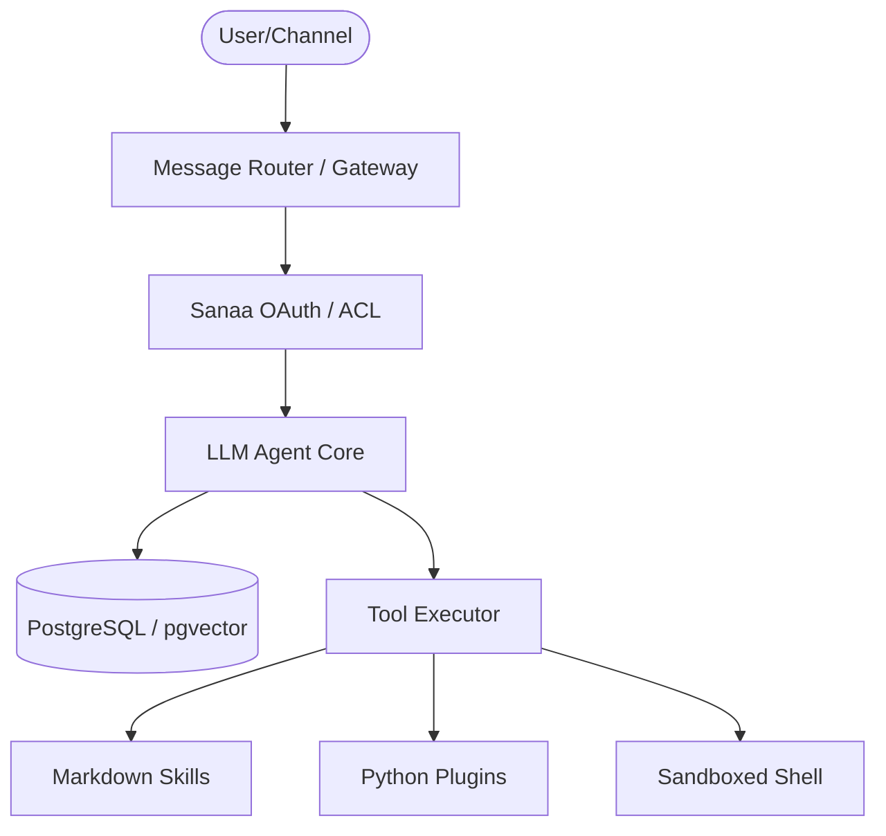

# 🚀 ANTIGRAVITY v2 — Master Blueprint

## 1. VISION
Antigravity v2 is a robust, autonomous AI Operations Agent designed for the Sanaa fintech platform. It leverages OpenClaw's architectural elegance while hardening it for production use with Python, PostgreSQL, and a Zero-Trust security model.

---

## 2. CORE ARCHITECTURE

### 2.1 Component Breakdown
- **Gateway**: Centralized message routing with strict origin checks.
- **Agent Core**: Orchestrates reasoning via top-tier LLMs (GPT-4o, Claude 3.5).
- **Memory**: Hybrid search (Vector + Keyword) on PostgreSQL. [Memory Spec](file:///root/.gemini/antigravity/brain/fb8e37bf-d385-4ea1-b562-a1f83abc32dc/memory-spec.md)
- **Extensibility**: Dual-layered Skill/Plugin system. [Skill Spec](file:///root/.gemini/antigravity/brain/fb8e37bf-d385-4ea1-b562-a1f83abc32dc/skill-spec.md)
- **Connectivity**: Native WhatsApp integration via Python-Baileys. [WhatsApp Spec](file:///root/.gemini/antigravity/brain/fb8e37bf-d385-4ea1-b562-a1f83abc32dc/whatsapp-spec.md)

---

## 3. SECURITY & RELIABILITY
- **Zero-Trust**: Mandatory auditing and input sanitization. [Security Guide](file:///root/.gemini/antigravity/brain/fb8e37bf-d385-4ea1-b562-a1f83abc32dc/security-guide.md)
- **Isolation**: Critical tools executed in sandboxed environments.
- **Model Hygiene**: Only instruction-hardened, high-parameter models allowed for tool-using agents.

---

## 4. IMPLEMENTATION ROADMAP
1. **Phase 1 (Backbone)**: Setup PostgreSQL, Gateway, and Basic Auth.
2. **Phase 2 (Connectivity)**: Deploy WhatsApp adapter and internal message routing.
3. **Phase 3 (Capabilities)**: Port OpenClaw skills to Antigravity v2 (S3, SSH, DB).
4. **Phase 4 (Hardening)**: Implement Skill-Scanner and Content wrapping.
